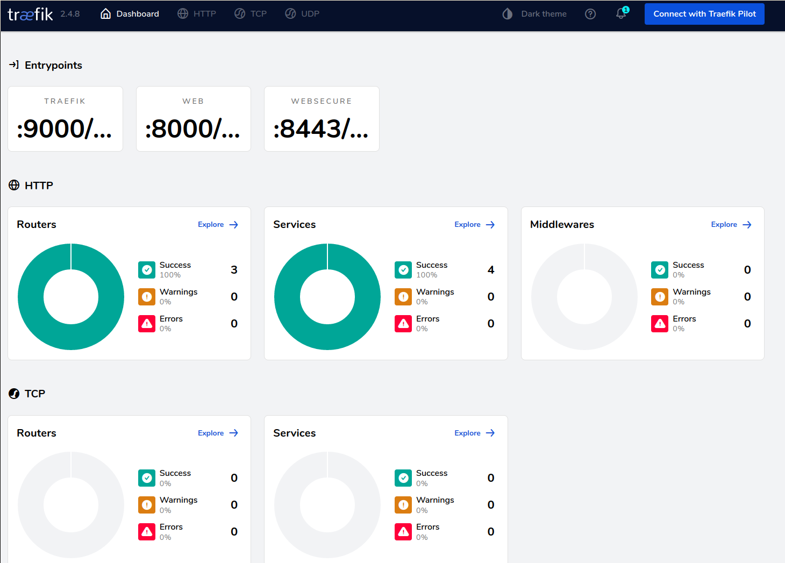

summary: Getting Started with Kubernetes
id: getting-started-kubernetes
status: Published 
authors: fteychene and Helm

# Getting Started with Kubernetes

## Setup

In this hands-on we will work using [k3s](https://k3s.io/), it's a lightweight Kubernetes distribution easy to install.  
We will not work with vanilla kubernetes as its installation could be challenging.

Using k3s should not change your experience since we will stay at a beginer level and asics of this distribution work as a vanilla kubernetes.

### Setup a VM

We will use Vagrant to spawn a VM a work with k3s.
```ruby
Vagrant.configure("2") do |config|
    config.vm.box = "ubuntu/focal64"
    config.vm.hostname = "kubemaster"
    config.vm.network  :private_network, ip: "10.0.0.11"
end
```

Start the VM and ssh into it
```bash
vagrant up
vagrant ssh
```

### Install k3s

To install k3s from the install scripty (not recommended in production) : 
```bash
curl -sfL https://get.k3s.io | sh -
```

Wait for the script to finish then watch nodes through kubernetes until the node is Ready :
```bash
sudo kubectl get nodes -w
```

Congratulation you have now a working kubernetes cluster ready to work on.  
If you want to learn more about Kubernetes components read [the doc](https://kubernetes.io/docs/concepts/overview/components/).

## Pods

In kubernetes world, containers running are named pods, there are more than just running container and I invite you to read the [official documentation](https://kubernetes.io/docs/concepts/workloads/pods/) about it.

Let's start by starting a Job with a pod from a busybox that just print something and sleep.
Create a file `basic.yml` with content :
```yml
apiVersion: batch/v1
kind: Job
metadata:
  name: hello
spec:
  template:
    # This is the pod template
    spec:
      containers:
      - name: hello
        image: busybox
        command: ['sh', '-c', 'echo "Hello, Kubernetes!" && sleep 3600']
      restartPolicy: OnFailure
    # The pod template ends here
```

And apply it by running
```
sudo kubectl apply -f basic.yml
```

Congratulation, you have now launched a Job in Kubernetes ! Let's have a look at that.

Let's start by looking at our pods by running
```bash
sudo kubectl get pod
```
You should seen a pod named `hello-xxxxx`, that's your pod 👏.  
We could look at its logs by running.
```bash
sudo kubectl logs <pod-name>
```

If I run it I got :
```
vagrant@kubemaster:~$ sudo kubectl logs hello-7kn7h
Hello, Kubernetes!
```
And that's what we want.

### Exercice

Create a job to run a busybox printing in the log a message configured by environment variable.  
Search in the documentation of kubernetes what need to be modify based on `basic.yml` file.

<!-- 
apiVersion: batch/v1
kind: Job
metadata:
  name: hello-env
spec:
  template:
    # This is the pod template
    spec:
      containers:
      - name: hello
        image: busybox
        command: ['sh', '-c', 'echo $DEMO_GREETING && sleep 3600']
        env:
        - name: DEMO_GREETING
          value: "Hello from the environment"
      restartPolicy: OnFailure
    # The pod template ends here
     -->

## Deployments

If pods are the basic unit in kubernetes, Deployment are the main unit for pushing deployment units. 
In the previous section to run a pod we start a Job, a Job is a one of pod execution, Deployments are a deployment unit to maintain a set of pod up & running.

Let's create a simple deployment without a file :
```bash
sudo kubectl create deployment kubernetes-bootcamp --image=gcr.io/google-samples/kubernetes-bootcamp:v1
```

Let's have a look at it :
```bash
sudo kubectl get deployments
```
We see our deployment 👍

Search associated pod name.  
When you have it let's se what we deployed. There is a `kubectl port-forward` that permit to redirect network form a port on the host to a pod (or a service) let's have a look.
```
sudo kubectl port-forward <pod-name> 8080:8080 --address=0.0.0.0
```
This command redirect the traffic from your host on 8080 listening to 0.0.0.0 (as from everywhere) into the port 8080 of the pod configured.  
Now we have this command running you can open your browser on your machine and go to http://10.0.0.11:8080 and you should see waht the application print.

### Exercice

Create a `deployment.yml` file that create a deployment of image "gcr.io/google-samples/kubernetes-bootcamp:v1" like we just do.


## Services

An abstract way to expose an application running on a set of Pods as a network service.  
Take some time to read the [official documentation](https://kubernetes.io/docs/concepts/services-networking/service/)

Next, let’s list the current Services from our cluster:
```bash
sudo kubectl get services
```

Let's expose our previous deployment.  
```
sudo kubectl expose deployment/kubernetes-bootcamp --type="NodePort" --port 8080
```
We just created a service of type NodePort (aka route all the traffic on a port from the host into deployment kubernetes-bootcamp).

We cand look at our service by running :
```bash
sudo kubectl get service
```
On my test run it look like
```
sudo kubectl get service
NAME                  TYPE        CLUSTER-IP      EXTERNAL-IP   PORT(S)          AGE
kubernetes            ClusterIP   10.43.0.1       <none>        443/TCP          148m
kubernetes-bootcamp   NodePort    10.43.246.196   <none>        8080:30325/TCP   2m21s
```
We know have a service that expose our deployment as a port, in my example : 30325.
Open now a browser on your machine and opne http://10.0.0.11/30325 (change with your own port) and your should see the application.

Let's look at how the service choose to which pod it send the traffic to.
```
sudo kubectl describe svc kubernetes-bootcamp
```
You should see a line `Selector:                 app=kubernetes-bootcamp`. It's this line that define how a service choose the pods to send to network.
By doing a selection based on their labels. To be sure about this, look as the description of the kuberneets-bootcamp pod to see that the label `app` exist with the value `kubernetes-bootcamp`.

### Exercice

Create a `service.yml` file that create the same service that we just created.

## Scale 

Let's scale our deployment.
```bash
sudo kubectl scale deployments/kubernetes-bootcamp --replicas=4
```
If you look at the pods, now the kubernetes-bootcamp is deployed with 4 pods each running the application. 

Let's look at how the service manage this. let's run a for loop and a curl to reuse the service (don't forget to set your port):
```bash
for i in {1..10}; do curl http://localhost:30325/; done
```
We see that the service load balance between the pods the calls and adapted to our scale. This is possible du to the selection of the pods with labels.


## Update

We can edit the deployment to change all the parameters. And we could also change the image to run.  
Let's try that and what happen by watching the pods :
```bash
sudo kubectl set image deployments/kubernetes-bootcamp kubernetes-bootcamp=jocatalin/kubernetes-bootcamp:v2
sudo kubectl get pods -w
```

We see that the pods are created then the old one are terminated.  
If we run a `curl http://localhost:30325/;` we should see that the server respond a `v=2` text.

### Exercice
Define a `complete.yml` file that define a deployment with 3 replicas of `gcr.io/google-samples/kubernetes-bootcamp:v1` and a associated NodePort service (in the same file).
Deploy it check that everything run
Update the file to set the replicas to 5 and the image to `jocatalin/kubernetes-bootcamp:v2` and apply the file to see the modifications applied

## Other resources

Kubernetes provide a lot of ressources by default you should check :
 - [Namespaces](https://kubernetes.io/docs/concepts/overview/working-with-objects/namespaces/) 
 - [DaemonSet](https://kubernetes.io/docs/concepts/workloads/controllers/daemonset/)
 - [ConfigMaps](https://kubernetes.io/docs/concepts/configuration/configmap/)
 - [Secrets](https://kubernetes.io/docs/concepts/configuration/secret/) 
 - [Networking after NodePort](https://kubernetes.io/docs/concepts/services-networking/)

There are plenty more but since it's not a certification but an introduction let's try some tools over Kubernetes.

## Helm

### Installing Helm

Lookup the installation steps from the documentation [here](https://helm.sh/docs/intro/install/)

### Using Helm

This guide explains the basics of using Helm to manage packages on your Kubernetes cluster.


#### Three Big Concepts

A Chart is a Helm package. It contains all of the resource definitions necessary to run an application, tool, or service inside of a Kubernetes cluster. Think of it like the Kubernetes equivalent of a Homebrew formula, an Apt dpkg, or a Yum RPM file.

A Repository is the place where charts can be collected and shared. It's like Perl's CPAN archive or the Fedora Package Database, but for Kubernetes packages.

A Release is an instance of a chart running in a Kubernetes cluster. One chart can often be installed many times into the same cluster. And each time it is installed, a new release is created. Consider a MySQL chart. If you want two databases running in your cluster, you can install that chart twice. Each one will have its own release, which will in turn have its own release name.

With these concepts in mind, we can now explain Helm like this:

Helm installs charts into Kubernetes, creating a new release for each installation. And to find new charts, you can search Helm chart repositories.
`helm search`: Finding Charts

Helm comes with a powerful search command. It can be used to search two different types of source:

- `helm search hub` searches the Artifact Hub, which lists helm charts from dozens of different repositories.
- `helm search repo` searches the repositories that you have added to your local helm client (with helm repo add). This search is done over local data, and no public network connection is needed.

You can find publicly available charts by running helm search hub:
```bash
$ helm search hub wordpress
URL                                                 CHART VERSION APP VERSION DESCRIPTION
https://hub.helm.sh/charts/bitnami/wordpress        7.6.7         5.2.4       Web publishing platform for building blogs and ...
https://hub.helm.sh/charts/presslabs/wordpress-...  v0.6.3        v0.6.3      Presslabs WordPress Operator Helm Chart
https://hub.helm.sh/charts/presslabs/wordpress-...  v0.7.1        v0.7.1      A Helm chart for deploying a WordPress site on ...
```

The above searches for all wordpress charts on Artifact Hub.

With no filter, `helm search hub` shows you all of the available charts.

Using `helm search repo`, you can find the names of the charts in repositories you have already added:

```bash
$ helm repo add brigade https://brigadecore.github.io/charts
"brigade" has been added to your repositories
$ helm search repo brigade
NAME                          CHART VERSION APP VERSION DESCRIPTION
brigade/brigade               1.3.2         v1.2.1      Brigade provides event-driven scripting of Kube...
brigade/brigade-github-app    0.4.1         v0.2.1      The Brigade GitHub App, an advanced gateway for...
brigade/brigade-github-oauth  0.2.0         v0.20.0     The legacy OAuth GitHub Gateway for Brigade
brigade/brigade-k8s-gateway   0.1.0                     A Helm chart for Kubernetes
brigade/brigade-project       1.0.0         v1.0.0      Create a Brigade project
brigade/kashti                0.4.0         v0.4.0      A Helm chart for Kubernetes
```

Helm search uses a fuzzy string matching algorithm, so you can type parts of words or phrases:
```bash
$ helm search repo kash
NAME            CHART VERSION APP VERSION DESCRIPTION
brigade/kashti  0.4.0         v0.4.0      A Helm chart for Kubernetes
```

Search is a good way to find available packages. Once you have found a package you want to install, you can use `helm install` to install it.

### Installing a Package

To install a new package, use the `helm install` command. At its simplest, it takes two arguments: A release name that you pick, and the name of the chart you want to install.

```bash
$ helm install happy-panda bitnami/wordpress
NAME: happy-panda
LAST DEPLOYED: Tue Jan 26 10:27:17 2021
NAMESPACE: default
STATUS: deployed
REVISION: 1
NOTES:
** Please be patient while the chart is being deployed **

Your WordPress site can be accessed through the following DNS name from within your cluster:

    happy-panda-wordpress.default.svc.cluster.local (port 80)

To access your WordPress site from outside the cluster follow the steps below:

1. Get the WordPress URL by running these commands:

  NOTE: It may take a few minutes for the LoadBalancer IP to be available.
        Watch the status with: 'kubectl get svc --namespace default -w happy-panda-wordpress'

   export SERVICE_IP=$(kubectl get svc --namespace default happy-panda-wordpress --template "{{ range (index .status.loadBalancer.ingress 0) }}{{.}}{{ end }}")
   echo "WordPress URL: http://$SERVICE_IP/"
   echo "WordPress Admin URL: http://$SERVICE_IP/admin"

2. Open a browser and access WordPress using the obtained URL.

3. Login with the following credentials below to see your blog:

  echo Username: user
  echo Password: $(kubectl get secret --namespace default happy-panda-wordpress -o jsonpath="{.data.wordpress-password}" | base64 --decode)
```

Now the wordpress chart is installed. Note that installing a chart creates a new release object. The release above is named `happy-panda`. (If you want Helm to generate a name for you, leave off the release name and use `--generate-name`.)

During installation, the helm client will print useful information about which resources were created, what the state of the release is, and also whether there are additional configuration steps you can or should take.

Helm installs resources in the following order:

- Namespace
- NetworkPolicy
- ResourceQuota
- LimitRange
- PodSecurityPolicy
- PodDisruptionBudget
- ServiceAccount
- Secret
- SecretList
- ConfigMap
- StorageClass
- PersistentVolume
- PersistentVolumeClaim
- CustomResourceDefinition
- ClusterRole
- ClusterRoleList
- ClusterRoleBinding
- ClusterRoleBindingList
- Role
- RoleList
- RoleBinding
- RoleBindingList
- Service
- DaemonSet
- Pod
- ReplicationController
- ReplicaSet
- Deployment
- HorizontalPodAutoscaler
- StatefulSet
- Job
- CronJob
- Ingress
- APIService

Helm does not wait until all of the resources are running before it exits. Many charts require Docker images that are over 600M in size, and may take a long time to install into the cluster.

To keep track of a release's state, or to re-read configuration information, you can use `helm status`:

```bash
$ helm status happy-panda
NAME: happy-panda
LAST DEPLOYED: Tue Jan 26 10:27:17 2021
NAMESPACE: default
STATUS: deployed
REVISION: 1
NOTES:
** Please be patient while the chart is being deployed **

Your WordPress site can be accessed through the following DNS name from within your cluster:

    happy-panda-wordpress.default.svc.cluster.local (port 80)

To access your WordPress site from outside the cluster follow the steps below:

1. Get the WordPress URL by running these commands:

  NOTE: It may take a few minutes for the LoadBalancer IP to be available.
        Watch the status with: 'kubectl get svc --namespace default -w happy-panda-wordpress'

   export SERVICE_IP=$(kubectl get svc --namespace default happy-panda-wordpress --template "{{ range (index .status.loadBalancer.ingress 0) }}{{.}}{{ end }}")
   echo "WordPress URL: http://$SERVICE_IP/"
   echo "WordPress Admin URL: http://$SERVICE_IP/admin"

2. Open a browser and access WordPress using the obtained URL.

3. Login with the following credentials below to see your blog:

  echo Username: user
  echo Password: $(kubectl get secret --namespace default happy-panda-wordpress -o jsonpath="{.data.wordpress-password}" | base64 --decode)
```

The above shows the current state of your release.

### Customizing the Chart Before Installing

Installing the way we have here will only use the default configuration options for this chart. Many times, you will want to customize the chart to use your preferred configuration.

To see what options are configurable on a chart, use helm show values:

```bash
$ helm show values bitnami/wordpress
## Global Docker image parameters
## Please, note that this will override the image parameters, including dependencies, configured to use the global value
## Current available global Docker image parameters: imageRegistry and imagePullSecrets
##
# global:
#   imageRegistry: myRegistryName
#   imagePullSecrets:
#     - myRegistryKeySecretName
#   storageClass: myStorageClass

## Bitnami WordPress image version
## ref: https://hub.docker.com/r/bitnami/wordpress/tags/
##
image:
  registry: docker.io
  repository: bitnami/wordpress
  tag: 5.6.0-debian-10-r35
  [..]
```

You can then override any of these settings in a YAML formatted file, and then pass that file during installation.

```bash
$ echo '{mariadb.auth.database: user0db, mariadb.auth.username: user0}' > values.yaml
$ helm install -f values.yaml bitnami/wordpress --generate-name
```

The above will create a default MariaDB user with the name user0, and grant this user access to a newly created user0db database, but will accept all the rest of the defaults for that chart.

There are two ways to pass configuration data during install:

- `--values` (or `-f`): Specify a YAML file with overrides. This can be specified multiple times and the rightmost file will take precedence
- `--set`: Specify overrides on the command line.

If both are used, `--set` values are merged into `--values` with higher precedence. Overrides specified with `--set` are persisted in a ConfigMap. Values that have been `--set` can be viewed for a given release with helm get values <release-name>. Values that have been `--set` can be cleared by running helm upgrade with `--reset-values` specified.

### The Format and Limitations of `--set`

The `--set` option takes zero or more name/value pairs. At its simplest, it is used like this: `--set name=value`. The YAML equivalent of that is:

```yaml
name: value
```

Multiple values are separated by , characters. So `--set a=b,c=d` becomes:

```yaml
a: b
c: d
```

More complex expressions are supported. For example, `--set outer.inner=value` is translated into this:

```yaml
outer:
  inner: value
```

Lists can be expressed by enclosing values in `{` and `}`. For example, `--set name={a, b, c}` translates to:

```yaml
name:
  - a
  - b
  - c
```

As of Helm 2.5.0, it is possible to access list items using an array index syntax. For example, `--set servers[0].port=80` becomes:

```yaml
servers:
  - port: 80
```

Multiple values can be set this way. The line `--set servers[0].port=80,servers[0].host=example` becomes:

```yaml
servers:
  - port: 80
    host: example
```

Sometimes you need to use special characters in your `--set` lines. You can use a backslash to escape the characters; `--set name=value1\,value2` will become:

```yaml
name: "value1,value2"
```

Similarly, you can escape dot sequences as well, which may come in handy when charts use the toYaml function to parse annotations, labels and node selectors. The syntax for `--set nodeSelector."kubernetes\.io/role"=master` becomes:

```yaml
nodeSelector:
  kubernetes.io/role: master
```

Deeply nested data structures can be difficult to express using `--set`. Chart designers are encouraged to consider the `--set` usage when designing the format of a values.yaml file (read more about Values Files).

### More Installation Methods

The `helm install` command can install from several sources:

- A chart repository (as we've seen above)
- A local chart archive (`helm install foo foo-0.1.1.tgz`)
- An unpacked chart directory (`helm install foo path/to/foo`)
- A full URL (`helm install foo https://example.com/charts/foo-1.2.3.tgz`)


### `helm upgrade` and `helm rollback`: Upgrading a Release, and Recovering on Failure

When a new version of a chart is released, or when you want to change the configuration of your release, you can use the `helm upgrade` command.

An upgrade takes an existing release and upgrades it according to the information you provide. Because Kubernetes charts can be large and complex, Helm tries to perform the least invasive upgrade. It will only update things that have changed since the last release.

```bash
$ helm upgrade -f panda.yaml happy-panda bitnami/wordpress
```

In the above case, the happy-panda release is upgraded with the same chart, but with a new YAML file:

```yaml
mariadb.auth.username: user1
```

We can use helm get values to see whether that new setting took effect.

```bash
$ helm get values happy-panda
mariadb:
  auth:
    username: user1
```

The `helm` get command is a useful tool for looking at a release in the cluster. And as we can see above, it shows that our new values from panda.yaml were deployed to the cluster.

Now, if something does not go as planned during a release, it is easy to roll back to a previous release using helm rollback [RELEASE] [REVISION].

```bash
$ helm rollback happy-panda 1
```

The above rolls back our happy-panda to its very first release version. A release version is an incremental revision. Every time an install, upgrade, or rollback happens, the revision number is incremented by 1. The first revision number is always 1. And we can use `helm history` [RELEASE] to see revision numbers for a certain release.

### Helpful Options for Install/Upgrade/Rollback

There are several other helpful options you can specify for customizing the behavior of Helm during an install/upgrade/rollback. Please note that this is not a full list of cli flags. To see a description of all flags, just run helm <command> --help.

 - `--timeout`: A Go duration value to wait for Kubernetes commands to complete. This defaults to 5m0s.
 - `--wait`: Waits until all Pods are in a ready state, PVCs are bound, Deployments have minimum (`Desired` minus `maxUnavailable`) Pods in ready state and - `Services have an IP address (and Ingress if a LoadBalancer) before marking the release as successful. It will wait for as long as the `--timeout` value. - `If timeout is reached, the release will be marked as `FAILED`. Note: In scenarios where Deployment has replicas set to 1 and `maxUnavailable` is not set - `to 0 as part of rolling update strategy, --wait will return as ready as it has satisfied the minimum Pod in ready condition.
 - `--no-hooks`: This skips running hooks for the command
 - `--recreate-pods` (only available for `upgrade` and `rollback`): This flag will cause all pods to be recreated (with the exception of pods belonging to deployments). (DEPRECATED in Helm 3)


### `helm uninstall`: Uninstalling a Release

When it is time to uninstall a release from the cluster, use the `helm uninstall` command:

```bash
$ helm uninstall happy-panda
```

This will remove the release from the cluster. You can see all of your currently deployed releases with the `helm list` command:

```bash
$ helm list
NAME            VERSION UPDATED                         STATUS          CHART
inky-cat        1       Wed Sep 28 12:59:46 2016        DEPLOYED        alpine-0.1.0
```

From the output above, we can see that the happy-panda release was uninstalled.

In previous versions of Helm, when a release was deleted, a record of its deletion would remain. In Helm 3, deletion removes the release record as well. If you wish to keep a deletion release record, use `helm uninstall --keep-history`. Using `helm list --uninstalled` will only show releases that were uninstalled with the `--keep-history` flag.

The `helm list --all` flag will show you all release records that Helm has retained, including records for failed or deleted items (if `--keep-history` was specified):

```bash
$  helm list --all
NAME            VERSION UPDATED                         STATUS          CHART
happy-panda     2       Wed Sep 28 12:47:54 2016        UNINSTALLED     wordpress-10.4.5.6.0
inky-cat        1       Wed Sep 28 12:59:46 2016        DEPLOYED        alpine-0.1.0
kindred-angelf  2       Tue Sep 27 16:16:10 2016        UNINSTALLED     alpine-0.1.0
```

Note that because releases are now deleted by default, it is no longer possible to rollback an uninstalled resource.


### Working with Repositories

Helm 3 no longer ships with a default chart repository. The `helm repo` command group provides commands to add, list, and remove repositories.

You can see which repositories are configured using `helm repo list`:

```bash
$ helm repo list
NAME            URL
stable          https://charts.helm.sh/stable
mumoshu         https://mumoshu.github.io/charts
```

And new repositories can be added with helm repo add:

```bash
$ helm repo add dev https://example.com/dev-charts
```

Because chart repositories change frequently, at any point you can make sure your Helm client is up to date by running helm repo update.

Repositories can be removed with helm repo remove.


### Creating Your Own Charts

The [Chart Development Guide](https://helm.sh/docs/topics/charts/) explains how to develop your own charts. But you can get started quickly by using the helm create command:

```bash
$ helm create deis-workflow
```
Creating deis-workflow

Now there is a chart in `./deis-workflow`. You can edit it and create your own templates.

As you edit your chart, you can validate that it is well-formed by running `helm lint`.

When it's time to package the chart up for distribution, you can run the helm package command:

```bash
$ helm package deis-workflow
deis-workflow-0.1.0.tgz
```

And that chart can now easily be installed by helm install:

```bash
$ helm install deis-workflow ./deis-workflow-0.1.0.tgz
...
```

Charts that are packaged can be loaded into chart repositories. See the documentation for Helm chart repositories for more details.


### Conclusion

This chapter has covered the basic usage patterns of the helm client, including searching, installation, upgrading, and uninstalling. It has also covered useful utility commands like `helm status`, `helm get`, and `helm repo`.

For more information on these commands, take a look at Helm's built-in help: `helm help`.

This introduction is also a copy/paste of the official [Helm doc](https://helm.sh/docs/intro/using_helm/). Because why recreate some basic guide when the existing official one is weel written.


## Traefik

Traefik is a load balancer with dynamic configuration reload that can be plugged with various backend to enable routing automatically and it work with Kubernetes.

Traefik is installed by default on `k3s` clusters so we could use it.

### Accessing dashboard

Traefik dashboard is not exposed through the exterior of the cluster by default. We need to add a `IngressRoute` configuration to enable it.

```yaml
apiVersion: traefik.containo.us/v1alpha1
kind: IngressRoute
metadata:
  name: traefik-external-dashboard
  namespace: kube-system
spec:
  entryPoints:
  - web
  routes:
  - kind: Rule
    match: PathPrefix(`/dashboard`) || PathPrefix(`/api`)
    services:
    - kind: TraefikService
      name: api@internal
```

Apply this ressource in your cluster and then test to access the Traefik dashboard on http://10.0.0.11/dashboard/#/.  
You should access the traefik dashboard.




### Expose a service

Let's first create a deployment with multiple replicas.

```yaml
apiVersion: apps/v1
kind: Deployment
metadata:
  name: whoami-deployment
  labels:
    app: whoami
spec:
  replicas: 3
  selector:
    matchLabels:
      app: whoami
  template:
    metadata:
      labels:
        app: whoami
    spec:
      containers:
      - name: whoami
        image: containous/whoami:v1.5.0
        imagePullPolicy: IfNotPresent
        ports:
        - containerPort: 80
```

Check the deployment and that all the pods are healthy.

Now that we have our application deployed, let's create a kubernetes Service to provide an entrypoint in the server for our application.

```yaml
apiVersion: v1
kind: Service
metadata:
  name: whoami-service
spec:
  selector:
    app: whoami
  ports:
    - protocol: TCP
      port: 80
      targetPort: 80
```

At this point, it's standard Kubernetes ressoucres. We created an application deployment with 3 replicas and a service to be able to communicate in the cluster with this application.  
Now let's create a specific traefik `IngressRoute` to expose our Service to the external world.

```yaml
apiVersion: traefik.containo.us/v1alpha1
kind: IngressRoute
metadata:
  name: whoami-ingress
spec:
  entryPoints:
    - web
  routes:
  - match: PathPrefix(`/whoami`)
    kind: Rule
    services:
    - name: whoami-service
      namespace: default
      port: 80
```

As you can see in the `apiVersion` this ressources is not a standard Kubernetes one, it's a Traefik specific one.  
Kubernetes allow third party system to create and manage ressources in the cluster with a mecanism named `Custom Ressource Definition`. We will not cover this in this course, but you could look about it by yourself.

This ressource create a descriptor for an `IngressRoute` as in route for incoming traffic to define some rule and send them to a target service.  
Here we defined that all request atching a path starting with `/whoami` should be sent to `whoami-service`.  

We could check that our application is availble from the outside of our cluster : http://10.0.0.11/whoami  
Check also the Treafik dashboard to look on how it's configured inside Traefik.

### Conclusion

We just have used a solution of Ingress controller that is available on Kubernetes. There are other solutions avaiables like NGinx, HAProxy, ...  You can find a more exhaustive list on the [official documentation](https://kubernetes.io/docs/concepts/services-networking/ingress-controllers/)

To find more information on Traefik, please look at the [official website](https://traefik.io/traefik/)